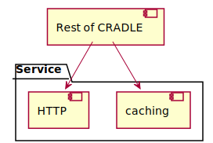
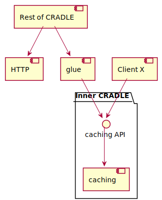

# Milestone one
Milestone one has three parts:

1. External C++ API
2. Isolating and improving inner core
3. Coroutines introspection

The introspection will mostly be implemented in the inner core, so related to part 2.

## External C++ API
See Tom's document `cppapi.md`.

## Inner core
* Functionality: caching and calculator coroutines
* Should already be interesting to some users
* Type agnostic: only blobs

The current design has a `service` directory offering caching and HTTP requests:

The idea is to factor out the caching functionality into a separate package, with an
interface that other users can access:

To do:
* Collect code in one location (currently in `caching/`, `core/id.*`, most of `service/`)
* Create a single C++ API
* No dynamic's (internal type system; they are still present in `sha256_hashed_id` and `service/core*`)
* Move anything non-blob to users of the inner core, or glue layer
* Improvement: no copying of heavy `sha256_hashed_id` objects
* Built into a separate library
* Unit test runner, built with and testing this library only
* Glue layer containing:
  * Convertors blob<-\>dynamic and blob<-\>Thinknode
  * Some implementation of the `id_interface` abstract base class; i.e., `sha256_hashed_id`,
    which currently is the only derived class that's being used
* Another unit test runner, built with inner core and glue libraries only, and testing combination
* Remove unused code like `id_ref`, `simple_id`, `id_pair`. Or move to glue?
* More clean-up

The main API functionality is to retrieve a blob:
* Input:
  * An `interface_id` object that uniquely identifies the request (in a `shared_ptr`?)
  * Caching level: no caching, memory only, or memory+disk
  * Functor that will create a `cppcoro::shared_task<blob>` if the requested blob is not in the cache;
    the coroutine will calculate the blob
* Output:
  * Blob (or failure?)

An `interface_id` object (currently an `sha256_hashed_id`):
* Can calculate a key for the memory cache; aim is not to have collisions for the current process
* Can calculate a key for the disk cache (SHA-256, probably much slower than the previous one)
* Optional faster "less than" and "equal" operations intended to avoid calculating memory cache keys.
  Note: it seems like this is not working for the current (hash-based) `unordered_map` used
  in `cache_record_map`, but it would be with a (tree-based) plain `map`.

A blob is represented identical or similar to the current `struct blob`:
a pointer to the data, a size, and an "owner" that will delete the data when it's no longer needed.
Or maybe a `shared_ptr`?

## Coroutines introspection
* The CLI will be an interactive Python interpreter
* Access via the websocket interface

To do:
* Add new websocket messages
* Add introspection to inner core
